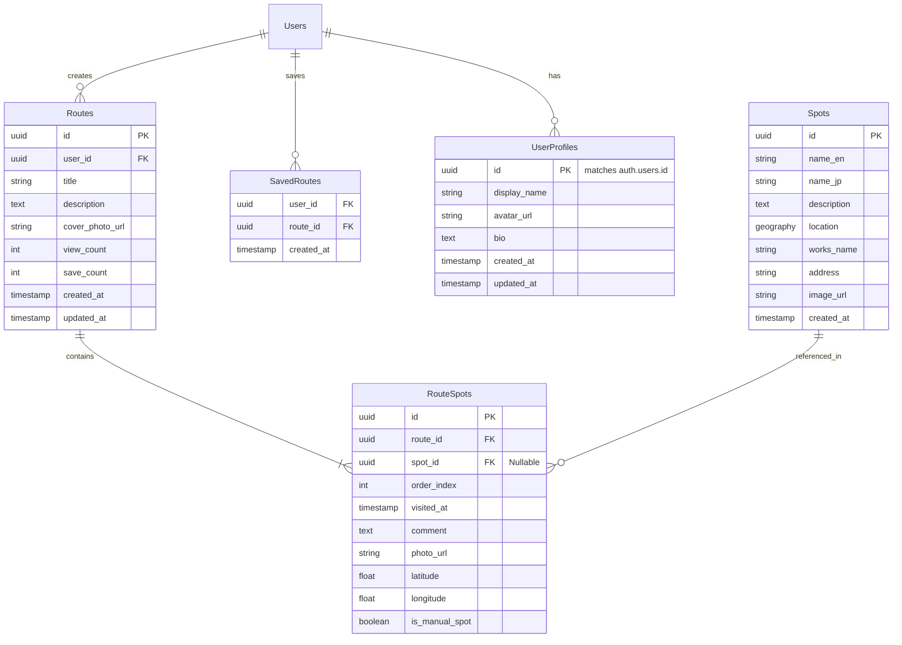

# データベース設計書

## 1. 概要
本ドキュメントは、「Seichi Route（仮）」で使用するデータベース（Supabase / PostgreSQL）の構造を定義します。

## 2. ER図

## 3. テーブル定義

### 3.1 `Spots` (聖地マスタ)
運営側が管理する、アニメや歴史の聖地スポット情報。

| カラム名 | データ型 | 制約 | 説明 |
| :--- | :--- | :--- | :--- |
| `id` | `uuid` | PK, Default `gen_random_uuid()` | スポットの一意ID |
| `name_en` | `text` | Not Null | 英語のスポット名 |
| `name_jp` | `text` | Nullable | 日本語のスポット名（検索用） |
| `description` | `text` | Nullable | スポットの説明・解説 |
| `location` | `geography(Point, 4326)` | Not Null | 緯度経度（PostGIS型） |
| `works_name` | `text` | Not Null | 関連する作品名（タグ） |
| `address` | `text` | Nullable | 住所文字列 |
| `image_url` | `text` | Nullable | 代表画像のURL |
| `created_at` | `timestamptz` | Default `now()` | 作成日時 |

### 3.2 `Routes` (投稿ルート)
ユーザーが作成した巡礼ルートのメタデータ。

| カラム名 | データ型 | 制約 | 説明 |
| :--- | :--- | :--- | :--- |
| `id` | `uuid` | PK, Default `gen_random_uuid()` | ルートの一意ID |
| `user_id` | `uuid` | FK (`auth.users.id`), Not Null | 作成ユーザーID |
| `title` | `text` | Not Null | ルートのタイトル |
| `description` | `text` | Nullable | ルートの説明・感想 |
| `cover_photo_url` | `text` | Nullable | 一覧表示用のカバー画像URL |
| `view_count` | `int` | Default 0 | 閲覧数 |
| `save_count` | `int` | Default 0 | 保存数 |
| `created_at` | `timestamptz` | Default `now()` | 作成日時 |
| `updated_at` | `timestamptz` | Default `now()` | 更新日時 |

### 3.3 `RouteSpots` (ルート内スポット)
ルートに含まれる個々の訪問地点。写真と位置情報を保持する。

| カラム名 | データ型 | 制約 | 説明 |
| :--- | :--- | :--- | :--- |
| `id` | `uuid` | PK, Default `gen_random_uuid()` | ルートスポットID |
| `route_id` | `uuid` | FK (`Routes.id`), On Delete Cascade | 親ルートID |
| `spot_id` | `uuid` | FK (`Spots.id`), Nullable | 紐づいた聖地ID（DBにない場所ならNull） |
| `order_index` | `int` | Not Null | ルート内での順序（0, 1, 2...） |
| `visited_at` | `timestamptz` | Nullable | 実際の訪問/撮影日時 |
| `comment` | `text` | Nullable | その場所へのコメント |
| `photo_url` | `text` | Not Null | ユーザーが投稿した写真URL |
| `latitude` | `float` | Not Null | 写真の撮影緯度（または指定座標） |
| `longitude` | `float` | Not Null | 写真の撮影経度（または指定座標） |
| `is_manual_spot` | `boolean` | Default `false` | 自動判定ではなく手動追加されたか |

### 3.4 `SavedRoutes` (保存リスト)
ユーザーが行きたいリストに追加したルート。

| カラム名 | データ型 | 制約 | 説明 |
| :--- | :--- | :--- | :--- |
| `user_id` | `uuid` | FK (`auth.users.id`), PK Composite | ユーザーID |
| `route_id` | `uuid` | FK (`Routes.id`), PK Composite | ルートID |
| `created_at` | `timestamptz` | Default `now()` | 保存日時 |

### 3.5 `UserProfiles` (ユーザープロフィール)
Clerk等の認証情報とは別に、アプリ内で表示するプロフィール情報。

| カラム名 | データ型 | 制約 | 説明 |
| :--- | :--- | :--- | :--- |
| `id` | `uuid` | PK, FK (`auth.users.id`) | ユーザーID（Authと1:1） |
| `display_name` | `text` | Nullable | 表示名 |
| `avatar_url` | `text` | Nullable | アイコン画像URL |
| `bio` | `text` | Nullable | 自己紹介 |
| `created_at` | `timestamptz` | Default `now()` | 作成日時 |
| `updated_at` | `timestamptz` | Default `now()` | 更新日時 |

## 4. インデックス設計
- `Spots`: `location`カラムに対してGISTインデックスを作成（地理空間検索の高速化）。
  - `CREATE INDEX spots_location_idx ON spots USING GIST (location);`
- `RouteSpots`: `route_id`に対してB-treeインデックス（ルート表示時の結合高速化）。
- `Routes`: `created_at` DESC（タイムライン表示用）。

## 5. RLS (Row Level Security) ポリシー
- **Spots**: Public Read Only（全ユーザー閲覧可、書き込みは管理者のみ）。
- **Routes**: Public Read（全ユーザー閲覧可）。Create/Update/Deleteは`auth.uid() = user_id`のみ。
- **RouteSpots**: 親のRoutesと同様。
- **SavedRoutes**: Create/Delete/Readは`auth.uid() = user_id`のみ。
- **UserProfiles**: Public Read。Updateは`auth.uid() = id`のみ。
