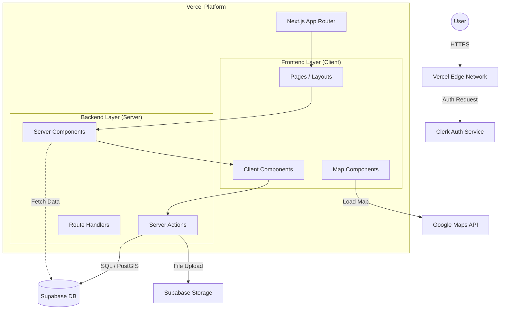

# システムアーキテクチャ設計書

## 1. 概要
本ドキュメントは、「Seichi Route（仮）」のシステム全体の技術構成とコンポーネント間の連携を定義します。

## 2. 技術スタック

### フロントエンド
- **Framework**: **Next.js 16+ (App Router)**
  - 選定理由: PWA対応が容易、Server Componentsによるパフォーマンス最適化、SEO優位性、Vercelとの親和性。
- **Language**: **TypeScript**
  - 選定理由: 型安全性による保守性と開発効率の向上。
- **Styling**: **Tailwind CSS**
  - 選定理由: ユーティリティファーストによる高速なスタイリング、モバイルファースト設計の容易さ。
- **UI Components**: **Radix UI / Lucide React**
  - 選定理由: アクセシビリティ対応のヘッドレスコンポーネントと軽量アイコンライブラリ。
- **Map Library**: **Google Maps API (Maps JavaScript API)**
  - 選定理由: グローバルでの信頼性、情報の正確性。

### バックエンド
- **Framework**: **Next.js Server Actions**
  - 選定理由: フロントエンドと統合されたバックエンドロジックの実装、APIエンドポイント管理の簡素化。
- **Database**: **Supabase (PostgreSQL + PostGIS)**
  - 選定理由: 位置情報検索（GEOクエリ）のネイティブサポート、フルマネージドサービスの利便性。
- **Storage**: **Supabase Storage**
  - 選定理由: 画像ファイルの保存と配信、DBとの統合認証。
- **Authentication**: **Clerk**
  - 選定理由: 最新のNext.js App Routerに対応した認証基盤、ソーシャルログイン実装の容易さ。

### インフラ・デプロイ
- **Hosting**: **Vercel**
  - 選定理由: Next.jsの最適化ホスティング、エッジネットワークによる高速配信。
- **CDN**: **Vercel Edge Network**

## 3. アーキテクチャ概要



### コンポーネントの役割
- **Vercel Edge Network**: ユーザーからのリクエストを最初に受け付け、静的コンテンツのキャッシュ配信やエッジ関数の実行を行う。
- **Next.js App Router**: ルーティング、レンダリング（SSR/SSG）、APIエンドポイントの提供を一元管理する。
- **Clerk**: ユーザー認証（サインアップ、ログイン、セッション管理）を担当し、Next.jsのMiddlewareで保護されたルートへのアクセスを制御する。
- **Supabase**: アプリケーションの永続データ（ユーザー情報、聖地データ、ルートデータなど）と画像ファイルを保存する。
- **Google Maps API**: クライアントサイドでの地図描画、マーカー表示を行う。

## 4. コンポーネント設計

### コンポーネント階層図

```mermaid
graph TD
    Layout[Root Layout] --> AuthProvider[ClerkProvider]
    AuthProvider --> Header[Header (RSC)]
    AuthProvider --> Main[Main Content]
    AuthProvider --> Footer[Footer (RSC)]
    
    Main --> HomePage[Home Page (RSC)]
    Main --> RouteDetail[Route Detail Page (RSC)]
    Main --> PostPage[Post Page (Client)]
    
    HomePage --> TimelineView[Timeline View (Client)]
    HomePage --> GridView[Grid View (Client)]
    
    RouteDetail --> SpotList[Spot List (RSC)]
    RouteDetail --> MapViewer[Map Viewer (Client)]
    
    PostPage --> PhotoUploader[Photo Uploader (Client)]
    PostPage --> RoutePreview[Route Preview (Client)]
    
    subgraph "Shared Components"
        Button
        Card
        Avatar
    end
```

### 主要コンポーネント定義

#### 1. `TimelineView` (Client Component)
- **役割**: ホーム画面でのタイムライン表示、スクロール検知、インタラクション。
- **Props**:
  ```typescript
  interface TimelineViewProps {
    initialRoutes: Route[]; // 初期表示データ
  }
  ```
- **State**:
  - `routes`: 表示中のルートリスト（無限スクロールで追加）
  - `viewMode`: 'timeline' | 'grid'
- **備考**: `framer-motion`等でスクロールアニメーションを付与。

#### 2. `MapViewer` (Client Component)
- **役割**: Google Mapsの描画、ルート（Polyline）とマーカーの表示。
- **Props**:
  ```typescript
  interface MapViewerProps {
    spots: Spot[]; // 表示するスポット
    routePath?: LatLng[]; // ルートの座標配列
    center?: LatLng;
    zoom?: number;
    interactive?: boolean; // 操作可能かどうか
  }
  ```
- **State**:
  - `selectedSpot`: タップされたマーカーの状態
- **備考**: Google Maps APIの読み込みコストを考慮し、必要な場面でのみロードする。

#### 3. `PhotoUploader` (Client Component)
- **役割**: 写真の選択、プレビュー表示、Exif情報の抽出。
- **Props**:
  ```typescript
  interface PhotoUploaderProps {
    onPhotosSelected: (photos: PhotoData[]) => void;
  }
  ```
- **State**:
  - `selectedFiles`: 選択されたFileオブジェクト
  - `isAnalyzing`: Exif解析中のローディング状態
- **備考**: クライアントサイドでExif解析を行い、サーバーへの送信データ量を最適化する。
