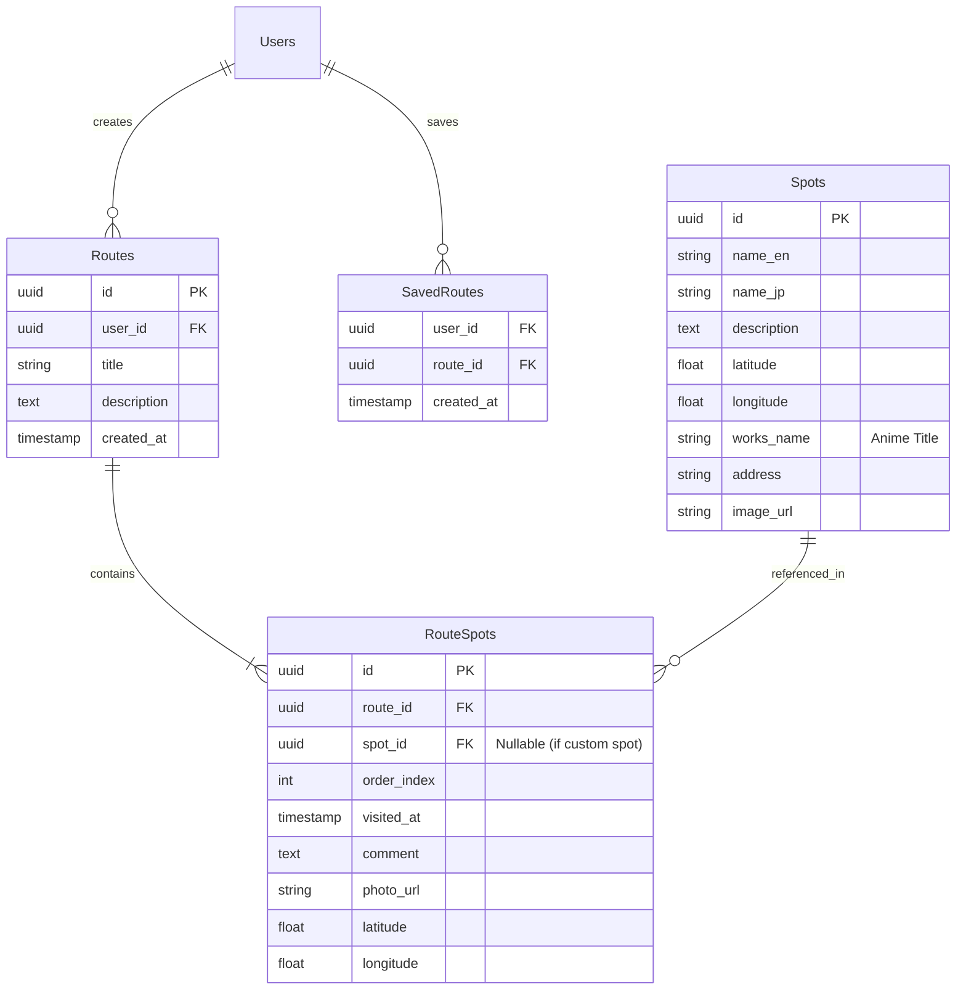
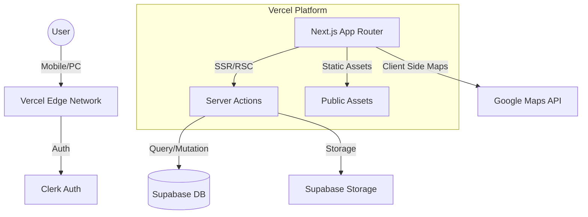

# 要件定義書：Seichi Route (仮)

## 1. プロジェクト概要

### 1.1 プロジェクト名
**Seichi Route（仮）開発プロジェクト**

### 1.2 背景・目的
- **背景**: 訪日外国人観光客が増加する中、アニメや日本文化の「聖地巡礼」ニーズが高まっている。しかし、言語の壁や情報の分散により、「行きたい場所の特定」や「効率的なルート計画」が困難である。
- **目的**: 
    - 訪日外国人が直感的に聖地を見つけ、迷わず訪れられるプラットフォームを提供する。
    - MVPリリース後、3ヶ月以内に初期コンテンツとして100件のルートを確保し、ユーザー体験を検証する。

### 1.3 システムのビジョン / スコープ
- **ビジョン**: **"See it, Route it, Snap it."** （見て、ルートにして、撮る）。誰もが「映え」と「冒険」を両立できる、世界一使いやすい聖地巡礼ナビゲーション。
- **スコープ**: 
    - **対象**: モバイルWebアプリ（PWA想定）としてMVPを開発。
    - **機能**: 写真閲覧、自動ルート生成、投稿、聖地DB管理。
    - **対象外**: ネイティブアプリ化、多言語対応（英語のみ）、複雑なSNS機能（DM等）、マネタイズ機能。

---

## 2. ビジネス要件

### 2.1 ビジネスモデル情報
- **ターゲット**: 日本のアニメ・マンガ・歴史に関心がある訪日外国人観光客（インバウンド）。
- **価値提案**: 
    - **Visual First**: 言葉がいらない、写真中心の検索体験。
    - **Auto Route**: 写真を撮るだけで記録になり、誰かのガイドになる。
    - **Accuracy**: 正確な位置情報DBによる「迷わない」安心感。
- **収益構造**: 当面なし（ユーザー獲得とデータ蓄積を優先）。将来的には自治体連携や広告モデルを想定。

### 2.2 成果指標（KPI/KGI）
- **KGI**: 訪日外国人にとっての「聖地巡礼の定番ツール」としての認知獲得。
- **KPI (MVPフェーズ)**:
    - **初期コンテンツ数**: 100ルート（ローンチ時）
    - **MAU**: 1,000人（リリース3ヶ月後）
    - **投稿率**: アクティブユーザーの5%が写真を投稿し、ルートを生成すること。

### 2.3 ビジネス上の制約
- **予算**: 初期開発コストを抑えるため、モダンなOSSと無料枠のあるSaaSを活用。
- **リソース**: 小規模チームでの開発を想定。
- **期間**: 開発期間は約1.5ヶ月でMVPリリースを目指す。

---

## 3. ユーザー要件

### 3.1 ユーザープロファイル / ペルソナ

#### メインペルソナ: Alex (20代・男性・アメリカ在住)
- **属性**: 大学生または若手社会人。アニメ（Naruto, Jujutsu Kaisen等）が好き。
- **状況**: 初めての日本旅行中。日本語は話せない。
- **課題**: 「ネットで見たあの鳥居に行きたいけど、Google Mapsで英語検索しても出てこない」「効率よく回りたいが、ルートを組むのが面倒」。
- **ニーズ**: 「写真を見て『これ！』と選びたい」「ここに行けば間違いないという確信が欲しい」。

#### サブペルソナ: Sarah (30代・女性・フランス在住)
- **属性**: ジブリ映画や歴史的な日本の街並みが好き。
- **状況**: 旅行前にじっくり計画を立てたい。
- **課題**: 「有名な場所だけでなく、雰囲気の良い隠れ家スポットを知りたい」。

### 3.2 ユーザーストーリー
1. **Alexとして**、タイムラインで見つけたカッコいい写真の場所に行きたい。**なぜなら**、自分も同じ構図で写真を撮ってSNSで自慢したいからだ。
2. **Alexとして**、その場所に行くための最適なルート（順番）を知りたい。**なぜなら**、限られた旅行期間で効率よく回りたいからだ。
3. **Alexとして**、自分が撮った写真を簡単に記録・共有したい。**なぜなら**、旅の思い出を綺麗に残したいが、手動で地図を作るのは面倒だからだ。
4. **Sarahとして**、エリア（例：京都）で絞り込んで聖地を探したい。**なぜなら**、明日の京都観光のプランを立てたいからだ。

### 3.3 MVP（Minimum Viable Product）の定義
- **MVPで実装する範囲**: 
    - **Must Have**機能に限定（閲覧、自動ルート生成、投稿）。
    - 対応エリアは主要観光地（東京、京都、大阪）と主要作品に絞る。
- **MVPのゴール**: 
    - 「写真から探して行く」体験が受け入れられるか検証する。
    - 自動ルート生成機能が実用的か（精度、手軽さ）を確認する。

---

## 4. 機能要件

### 4.1 機能一覧 / MoSCoW 分類

| 機能 ID | 機能名 | 要約 | Must/Should/Could/Won't | MVP 対象 |
| :--- | :--- | :--- | :--- | :--- |
| **F-001** | **タイムライン閲覧** | 写真＋簡易マップの縦スクロール表示 | Must | Yes |
| **F-002** | **グリッド閲覧** | 画像タイル一覧表示 | Must | Yes |
| **F-003** | **詳細・ルート表示** | スポット詳細と移動順序の表示 | Must | Yes |
| **F-004** | **写真アップロード** | 複数枚写真選択・アップロード | Must | Yes |
| **F-005** | **自動ルート生成** | Exif解析とDB照合によるルート作成 | Must | Yes |
| **F-006** | **手動スポット修正** | 自動判定ミスの修正機能 | Must | Yes |
| **F-007** | **ユーザー登録/ログイン** | Clerk利用（メール/ソーシャル） | Must | Yes |
| **F-008** | **マイページ** | 自分の投稿・保存リスト確認 | Must | Yes |
| **F-009** | **保存（Save）** | 気に入ったルートのブックマーク | Must | Yes |
| **F-010** | **検索・フィルタ** | 作品名・エリアでの絞り込み | Should | Yes |
| **F-011** | **聖地DB管理** | 管理者によるスポットCRUD | Must | Yes |
| **F-012** | **多言語対応** | 英語以外の言語対応 | Won't | No |

### 4.2 機能詳細仕様

#### 4.2.1 `<機能 ID: F-005 自動ルート生成機能>`
- **概要**: ユーザーがアップロードした写真のExif情報（位置・日時）を解析し、聖地DBと照合して、時系列の巡礼ルートを自動生成する。
- **ユースケース**: 「旅行中に撮った写真をまとめてアップし、旅の記録を作成する」
- **前提条件**: 写真に位置情報（GPS）が付与されていること。
- **正常系フロー**:
    1. ユーザーが投稿ボタンを押し、カメラロールから写真（例：5枚）を選択する。
    2. フロントエンドでExif情報を解析（撮影日時、緯度経度）。
    3. バックエンドAPIへ解析データを送信。
    4. バックエンドが各写真の緯度経度から、半径Nメートル以内の「聖地スポット」をDBから検索。
    5. 最も近いスポットを候補として紐付ける。
    6. 撮影日時順にスポットを並べ替え、ルートオブジェクトを生成して返す。
    7. ユーザー確認画面に、地図とルート（ピンがつながった状態）を表示する。
- **例外系フロー**:
    - **位置情報がない場合**: 「Unknown Location」として表示し、ユーザーに手動でのスポット検索・選択を促す。
    - **近くに聖地がない場合**: 「スポットが見つかりません」とし、単なる写真投稿として扱うか、手動紐付けを促す。
- **UI 要件**:
    - 解析中はローディングアニメーションを表示（"Analyzing your journey..."）。
    - 候補地が複数ある場合は、ユーザーがタップして変更できるようにする。

#### 4.2.2 `<機能 ID: F-001/F-002 閲覧機能（タイムライン/グリッド）>`
- **概要**: 投稿されたルートを「映え」重視で閲覧する。
- **UI 要件**:
    - **Timeline**: 画面幅いっぱいの写真。写真の下に「スポット名」「作品名」と、小さな地図（ルート概要）を表示。
    - **Grid**: 正方形またはアスペクト比維持のタイル表示。タップすると詳細モーダルまたは詳細ページへ遷移。
    - ヘッダーのスイッチで即座に切り替え可能（状態を保持）。
    - 無限スクロール対応。

---

## 5. UI/UX設計

### 5.1 デザインコンセプト
- **コンセプト**: **"Immersive Japan"**（没入する日本）
- **トーン＆マナー**: **Clean & Vibrant**
    - ベース: ホワイト（#FFFFFF）またはダークグレー（#121212）
    - アクセント: **Japan Red**（#BC002D） - 鳥居や日の丸を想起させる赤。
    - フォント: **Inter** (英数字), **Noto Sans JP** (日本語が必要な場合)
- **UX指針**: **Effortless**
    - 文字を読ませない。写真で語る。
    - タップ数を減らす。

### 5.2 画面一覧
1. **Splash Screen**: ロゴ表示
2. **Onboarding**: コンセプト説明、初期ジャンル選択
3. **Home (Timeline/Grid)**: メイン閲覧画面
4. **Route Detail**: ルート詳細、地図、スポットリスト
5. **Post (Select Photos)**: 写真選択
6. **Post (Confirm/Edit)**: ルート確認、タイトル入力
7. **My Page**: プロフィール、投稿一覧、保存一覧
8. **Login/Signup**: Clerk認証画面

### 5.3 画面遷移図 (Mermaid)

```mermaid
graph TD
    Splash --> Onboarding
    Onboarding --> Login[Login/Signup]
    Login --> Home[Home (Timeline/Grid)]
    
    Home -->|Tap Photo| Detail[Route Detail]
    Detail -->|Save| MyPage
    
    Home -->|Switch View| Home
    
    Home -->|Tap FAB| PostSelect[Post: Select Photos]
    PostSelect --> PostConfirm[Post: Confirm Route]
    PostConfirm -->|Submit| Detail
    
    Home -->|Tap Profile| MyPage
    MyPage -->|Tap Post| Detail
```

### 5.4 ワイヤーフレーム（主要画面）

**A. Home (Timeline)**
```
[Header: Logo | Switch(List/Grid) | Search Icon]
------------------------------------------------
[Photo Card]
  [Large Photo 4:5 aspect ratio]
  [Title: "Akihabara Cyberpunk Night"]
  [User Icon] by Alex
  [Map Preview (Small)] -> Route: A -> B -> C
  [Tags: #Akira #Cyberpunk]
------------------------------------------------
[Bottom Nav: Home | Post(+) | MyPage]
```

**B. Post (Confirm)**
```
[Header: New Post | Post Button(Red)]
------------------------------------------------
[Title Input: "My Naruto Trip"]
[Comment Input: "Awesome day!"]
------------------------------------------------
[Timeline Route View]
  ( | ) 10:00 AM
  [Photo Thumb] -> [Spot: Konoha Gate (Detected)] [Edit]
  ( | )
  ( | ) 11:30 AM
  [Photo Thumb] -> [Spot: Ichiraku Ramen (Detected)] [Edit]
------------------------------------------------
[Map Preview with Polyline]
```

---

## 6. 非機能要件

### 6.1 パフォーマンス要件
- **画像表示**: CDN (Vercel Blob / Cloudinary等) を利用し、WebP形式で配信。First Contentful Paint (FCP) 1.5秒以内。
- **APIレスポンス**: 聖地検索APIは500ms以内。

### 6.2 セキュリティ要件
- **位置情報プライバシー**: 投稿時、聖地DBにマッチしなかった地点（自宅やホテル等）の座標は、サーバー保存時に間引きまたはマスク処理を行うことを検討（MVPではユーザーに削除を促すUIで対応）。

### 6.3 ユーザビリティ
- **モバイルファースト**: タップ領域は44px以上確保。
- **英語のみ**: 全てのUIテキスト、エラーメッセージは英語。

---

## 7. データベース設計

### 7.1 ER図 (Mermaid)



### 7.2 主要テーブル定義

**Spots (聖地マスタ)**
- `id`: UUID (PK)
- `name_en`: String (英語スポット名)
- `location`: Geography(Point) (緯度経度・PostGIS)
- `works_name`: String (作品名タグ)

**RouteSpots (ルート内スポット)**
- `route_id`: UUID (FK)
- `photo_url`: String (写真パス)
- `visited_at`: Timestamp (撮影日時)
- `spot_id`: UUID (FK, Nullable) - 自動判定された聖地ID

---

## 8. インテグレーション要件

### 8.1 外部サービス
- **認証**: **Clerk** (ユーザー管理、Auth UI)
- **DB/Storage**: **Supabase** (PostgreSQL, Storage)
- **地図**: **Google Maps API** (Maps JavaScript API, Places API)

### 8.2 API仕様例
- `POST /api/routes/generate`
    - Request: `{ photos: [{ url, lat, lng, taken_at }, ...] }`
    - Response: `{ route: [{ spot_id, spot_name, lat, lng, is_matched }, ...] }`
    - 処理: 位置情報をもとに`Spots`テーブルをPostGISで空間検索(`ST_DWithin`)し、マッチングを行う。

---

## 9. 技術選定とアーキテクチャ

### 9.1 技術スタック
- **Frontend**: Next.js 16+ (App Router), React, Tailwind CSS, Lucide React
- **Backend**: Next.js Server Actions
- **Database**: Supabase (PostgreSQL + PostGIS)
- **Auth**: Clerk
- **Deploy**: Vercel

### 9.2 アーキテクチャ概要図 (Mermaid)



### 9.3 コンポーネント設計方針
- **Server Components (RSC)**: 
    - `Home`, `RouteDetail`, `MyPage` などのページコンポーネント。
    - データフェッチ（DBアクセス）はここで行い、PropsとしてClient Componentsに渡す。
- **Client Components**: 
    - `MapViewer`, `PhotoUploader`, `TimelineInteraction` (いいねボタン等)。
    - ブラウザAPI（Geolocation）やインタラクションが必要な箇所。
- **状態管理**: 
    - 複雑なグローバルステートは避け、URLパラメータやServer State (React Query等は使わずServer Actions + useFormState等) を基本とする。
    - 投稿中の写真データなど一時的なローカル状態は `useState` / `useReducer` で管理。

---

## 10. リスクと課題

| リスク | 対応策 |
| :--- | :--- |
| **初期コンテンツ不足** | 開発チームまたは委託により、リリース時に主要聖地100ルート分を作成・投入する。 |
| **Exif情報取得不可** | SNS経由の画像等で位置情報がない場合、ユーザーに「地図から場所を選択」させるUIを用意する。 |
| **Google Mapsコスト** | マップのロード回数を抑制するため、リスト画面ではStatic Maps画像を使用する等の最適化を行う。 |

---

## 11. ランニング費用と運用方針

### 11.1 概算費用 (月額)
- **Vercel**: Hobby Plan ($0) - MVP段階
- **Supabase**: Free Tier ($0)
- **Clerk**: Free Tier ($0) - 10,000 MAUまで
- **Google Maps**: $200分の無料枠内を想定（超過時は従量課金）
- **合計**: **ほぼ $0** でスタート可能

### 11.2 運用体制
- **開発・運用**: エンジニア1-2名で兼務。
- **監視**: Vercel Analytics, Supabase Dashboardでエラー監視。

---

## 12. 変更管理
- **管理**: GitHub Issuesにて機能追加・バグ修正を管理。
- **ドキュメント**: 本ドキュメント(`detailed_requirements_specification.md`)を正とし、変更時は更新履歴を残す。
