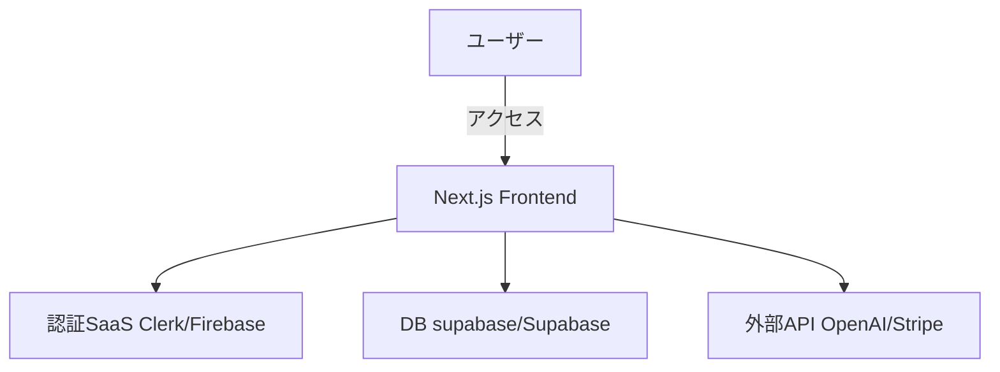

# 要件定義書テンプレート

## 1. プロジェクト概要

### 1.1 プロジェクト名

- 例: **「○○ システム開発プロジェクト」**

### 1.2 背景・目的

- **背景**: ビジネス上、あるいは市場の動向など、なぜこのシステムを開発するのか
- **目的**: 解決したい課題や目標とする成果を定量的に示す

### 1.3 システムのビジョン / スコープ

- **ビジョン**: 将来的にシステムが目指す姿や、利用者に提供する価値のゴールイメージ
- **スコープ**: 今回の開発対象に含まれる範囲（含まれない範囲も明確にする）

> 例: 今回は Web アプリとして MVP を実装。将来的にスマホアプリ展開やハードウェア連携を想定しているが、本フェーズでは対象外。

---

## 2. ビジネス要件

### 2.1 ビジネスモデル情報（任意）

- **リーンキャンバス**のまとめ（解決する課題・価値提案・収益構造など）
- **7Powers**視点での優位性検討（スケール／ネットワーク効果など）
- **市場規模 / 成長予測**: 数値的な見込み（ユーザー数、売上など）

### 2.2 成果指標（KPI/KGI）

- 具体的にどの数値を計測し、いつまでに何を達成するか
- 例: **月間アクティブユーザー (MAU) 1,000 人を 3 か月後に達成** など

### 2.3 ビジネス上の制約

- 予算・開発期間・リソース面での制約
- 法的要件・規制（個人情報保護、業種特有の規制等）があれば記載

---

## 3. ユーザー要件

### 3.1 ユーザープロファイル / ペルソナ

- 目標とするユーザー像（年齢層、利用シーン、利用デバイスなど）
- ユーザーの課題、不満点

### 3.2 ユーザーストーリー

- **形式**: 「〇〇として、△△ がしたい。なぜなら □□ だからだ。」
- 主要なユーザーストーリーを 3〜5 個程度挙げる

> 例: 「飲食店経営者として、新メニューを素早く宣伝したい。なぜなら広告費を抑えつつ売上を伸ばせるからだ。」

### 3.3 MVP（Minimum Viable Product）の定義

- **MVP で実装する範囲**: コア機能だけか、付随機能も含むか
- **MVP のゴール**: 早期リリース / 早期フィードバック獲得 など

---

## 4. 機能要件

### 4.1 機能一覧 / MoSCoW 分類

| 機能 ID | 機能名           | 要約                                     | Must/Should/Could/Won't | MVP 対象 |
| ------- | ---------------- | ---------------------------------------- | ----------------------- | -------- |
| F-001   | ユーザー登録機能 | メールアドレスとパスワードによる新規登録 | Must                    | Yes      |
| F-002   | ログイン機能     | ユーザーがログインを行う機能             | Must                    | Yes      |
| F-003   | ...              | ...                                      | ...                     | ...      |

### 4.2 機能詳細仕様

#### 4.2.1 `<機能 ID: F-001 ユーザー登録機能>`

- **概要**: ユーザーがメールアドレスとパスワードを登録し、新規アカウントを作成する
- **ユースケース**: 「新規ユーザーが初めてサービスを利用するとき」
- **前提条件**: 事前に SaaS（Clerk / Firebase Auth など）が導入されている
- **正常系フロー**:
  1. ユーザーが登録画面を開く
  2. 必要項目（メールアドレス、パスワード）を入力
  3. バリデーション（AI が生成したバリデーションロジックなど）
  4. 登録完了 → メールアドレスに確認メール送信（SaaS 利用）
- **例外系フロー**:
  - 既に登録済みのメールアドレスの場合
  - パスワードが要件（8 文字以上など）を満たさない場合
- **UI 要件**:
  - 入力エラー時にはリアルタイムでエラー表示
  - 画面遷移せずにエラーメッセージを表示
- **非機能面注意**:
  - セキュリティ（暗号化通信、CSRF / XSS 対策）
  - レスポンス性能（3 秒以内に完了画面表示など）

> 他の機能についても同様の形式で記載

---

## 5. 非機能要件

### 5.1 パフォーマンス要件

- **レスポンス時間**: 主要画面は 3 秒以内
- **同時接続数**: 1,000 ユーザー同時アクセスに対応
- **処理量**: 1 日あたり 10,000 リクエストを想定

### 5.2 セキュリティ要件

- **認証／認可**: Clerk などの外部認証サービスを利用、JWT トークン管理など
- **データ保護**: HTTPS 通信、個人情報の暗号化保存
- **監査ログ**: 管理者による不正アクセス／操作ログを記録
- **コンプライアンス**: 個人情報保護法、GDPR などに準拠

### 5.3 可用性・信頼性

- **稼働率**: 99.9%以上
- **障害時の復旧手順 / DR 対応**: バックアップ方針（頻度、保存期間 など）
- **フェイルオーバー**: 必要に応じてマルチリージョン対応を検討

### 5.4 ユーザビリティ / UI・UX

- **アクセシビリティ**: WCAG などのガイドライン考慮
- **多言語対応の有無**: 主に日本語、必要に応じ英語対応など
- **操作導線**: できるだけクリック数が少なくなる設計

### 5.5 スケーラビリティ

- **水平/垂直スケーリング**: クラウド環境（Vercel, AWS, etc.）のオートスケール
- **突発的アクセス増対策**: キャッシュ戦略、リトライ制御など

---

## 6. インテグレーション要件

### 6.1 外部サービス / SaaS 連携

- **認証系**: Clerk, Firebase Auth, Supabase Auth など
- **データベース系**: supabase, Railway, Supabase, MongoDB Atlas など
- **決済系**: Stripe, PayPal, Square
- **ストレージ系**: AWS S3, Cloudflare R2, Firebase Storage
- **AI・ML 系**: OpenAI API, Claude, Gemini など

### 6.2 API 仕様

- **提供・利用 API**: REST / GraphQL / gRPC など
- **エンドポイント例**:
  - `POST /api/register`
  - `GET /api/users/{id}`
- **HTTP メソッド**とリクエスト / レスポンスフォーマット（JSON, XML など）

### 6.3 データ連携要件

- **データ形式**: JSON, CSV 等
- **頻度**: リアルタイム or バッチ
- **再送制御**: 通信失敗時のリトライ制御など

---

## 7. 技術選定とアーキテクチャ

### 7.1 技術スタックの要約

- **フロントエンド**: Next.js, React, TailwindCSS
- **バックエンド**: Next.js の API Routes または Serverless Functions など
- **データベース**: supabase, Supabase, MySQL on Railway など
- **認証**: Clerk / Firebase Auth
- **ホスティング / デプロイ**: Vercel, Netlify, AWS 等

### 7.2 アーキテクチャ概要

- **UI 層**: Next.js, React
- **API 層**: Next.js API Routes, Serverless Functions
- **DB 層**: SaaS (supabase / Supabase / etc.)
- **外部連携**: Stripe, AWS S3, OpenAI API など

### 7.3 システム構成図 (簡易例)

## 8. 開発プロセス / スケジュール

### 8.1 開発モデル・プロセス

- **アジャイル / イテレーティブ**: MVP → フィードバック → 改善
- **ウォーターフォール**: （必要に応じて）最初に仕様を固め一括実装

### 8.2 スケジュール例

| フェーズ       | 期間          | 主なタスク                                              |
| -------------- | ------------- | ------------------------------------------------------- |
| 要件定義       | ○○ 月～ ○○ 月 | ユーザーストーリー作成、機能リスト確定、MoSCoW 分類など |
| デザイン       | ○○ 月～ ○○ 月 | UI/UX デザイン案作成、モックアップ                      |
| 実装（MVP）    | ○○ 月～ ○○ 月 | フロント/バックエンド実装、SaaS 連携                    |
| テスト         | ○○ 月～ ○○ 月 | 機能テスト、UI テスト、負荷テスト                       |
| リリース＆検証 | ○○ 月～ ○○ 月 | ユーザー検証、改善要望収集、次フェーズ計画              |

---

## 9. リスクと課題

### 10.1 リスク一覧

| No  | リスク内容          | 影響度 | 発生確率 | 対応策                                               |
| --- | ------------------- | ------ | -------- | ---------------------------------------------------- |
| R1  | SaaS が突然仕様変更 | 高     | 低       | 代替サービスの検討、API バージョン管理               |
| R2  | 開発要員の不足      | 中     | 中       | AI ツール活用で開発効率化、機能開発の優先度見直し    |
| R3  | セキュリティ脆弱性  | 高     | 中       | WAF 導入、定期的な脆弱性診断やペネトレーションテスト |

### 10.2 課題 / 前提条件

- チームのスキルセット（Next.js 経験が少ない等）
- 予算上限と必要機能のバランス
- 外部 API レート制限への対応

---

## 11. ランニング費用と運用方針

### 11.1 ランニング費用の目安

- **SaaS**: Clerk 認証、suopabase,Neon DB などの無料枠メイン利用で月 0〜10$
- **デプロイ**: Vercel の無料プランで月 0$
- **AI API**: OpenAI API 等の利用量に応じた従量課金

### 11.2 運用・保守体制

- **運用チーム**: ○ 名（開発者 or 運用担当）
- **監視ツール**: Sentry / Datadog / etc.
- **アップデート頻度**: 月 1 回程度を目安

---

## 12. 変更管理

- 要件変更の合意プロセス（承認フロー）
- GitHub Issue / Pull Request での履歴管理
- AI ツール（Cursor, ChatGPT 等）での議事録・要件トレース活用

---

## 13. 参考資料 / 関連ドキュメント

- ノーションで管理している機能要件・デザイン資料
- 各 SaaS のドキュメントへのリンク
- プロンプトテンプレート集

---

> **補足**:
>
> - **アジャイル開発**の場合、初期段階の要件定義を完全に固めず MVP リリース後に随時更新する進め方が一般的です。
> - **ウォーターフォール**開発や大規模開発の場合は、上記要件定義をさらに詳細化し、承認フローを明確にしておく必要があります。
> - **AI 活用**（Cursor, ChatGPT, Claude など）により、要件定義書の抜け漏れチェックや更新作業の効率化が期待できます。
